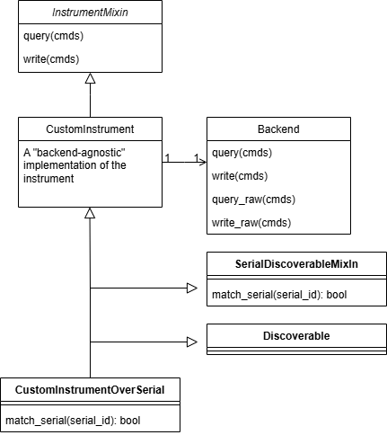

.. py:module:: secbench.api

.. _module-api:

Module: ``secbench.api``
========================

The :py:mod:`secbench.api` module contains common definitions used across
secbench packages. The primary goal of the package is to define interfaces of
all instruments relevant for hardware security characterization such as
side-channel analysis and fault injections. But the package other important things:

- A convenient discovery mechanism for available hardware. This mechanism is
  configurable and allows loading instruments without hard-coding them in scripts (TTY paths, serial numbers, etc.).
- A :py:class:`Bench` that manages all equipment for experiments.
- Helpers to implement drivers in few lines of codes for lab equipments, though serial, Ethernet, USB.

Exceptions
----------

Most errors that occur in the internal layers of secbench are subclasses of
:py:class:`SecbenchError`.

.. autoexception:: secbench.api.exceptions.SecbenchError

.. autoexception:: secbench.api.exceptions.BackendError

.. autoexception:: secbench.api.exceptions.NoSuchHardwareError

.. autoexception:: secbench.api.exceptions.MissingDependency

.. autoexception:: secbench.api.exceptions.InstrumentError

.. autoexception:: secbench.api.exceptions.InstrumentPendingErrors

.. autoexception:: secbench.api.exceptions.UnsupportedFeature

.. autoexception:: secbench.api.exceptions.InvalidParameter

.. autoexception:: secbench.api.exceptions.NoSuchChannelError

Bench
-----

A :py:class:`Bench` allows **discovery** and **instantiation** of hardware.
You can create a :py:class:`Bench` instance by calling the default constructor
without arguments:

.. code-block:: python

    from secbench.api import Bench
    bench = Bench()

In security tests, unless you have to run multiple experiments in parallel in
the same scripts, it is recommended to use the :py:func:`get_bench` function to
create a bench. It returns a common bench instance, acting as a global
variable.

.. code-block:: python

    from secbench.api import get_bench
    bench = get_bench()

The :py:class:`Bench` class provides methods for requesting different type of
hardware.  Note that by default, a bench will cache the components loaded, so
that hardware discovery is not ran every time.

.. code-block:: python

    from secbench.api import get_bench
    from secbench.api.instrument import Scope

    bench = get_bench()
    scope = bench.get_scope() # Slow the first time.
    scope = bench.get_scope() # Fast: a scope is already in the bench.
    scope = bench.get(Scope)  # Fast: same as the previous line.

More details on this topic are available in the tutorial :ref:`sec:secbench-essential-concepts`.

.. autoclass:: secbench.api.Bench

.. autofunction:: secbench.api.get_bench

Device Discovery
----------------

.. note::

   Understanding this section is not required for a regular secbench usage.
   It is indented to developpers and advanced users.

To implement automatic device discovery any class of instrument that is
discoverable (Scope, Afg, ...) implements the ``Discoverable`` interface:

.. autoclass:: secbench.api.Discoverable

.. autoclass:: secbench.api.DiscoverPolicy

In very specific use cases, you can directly discover a specific class (without
passing through a Bench) using the :py:func:`discover` method.

.. autofunction:: secbench.api.discover

Types and Enumerations
----------------------

All enumerations are available in the ``secbench.api.enums`` namespace.

Enumerations used in the control of oscilloscopes:

.. autoclass:: secbench.api.enums.Coupling

.. autoclass:: secbench.api.enums.Slope

.. autoclass:: secbench.api.enums.Arithmetic

.. autoclass:: secbench.api.enums.Decimation

Enumerations used in the control of arbitrary function generators:

.. autoclass:: secbench.api.enums.Function

.. autoclass:: secbench.api.enums.OutputLoad

.. autoclass:: secbench.api.enums.Polarity

.. autoclass:: secbench.api.enums.TriggerSource

Enumerations used in the control of power supplies (PSU):

.. autoclass:: secbench.api.enums.TrackingMode

Scope
-----

In order to use a :py:class:`instrument.Scope` you will first obtain
it through a :py:class:`Bench` and the :py:meth:`Bench.get_scope` method.
Then, you can use the following interface implemented by all scope.

Although some scope provide some extra functionalities, we do not recommend to
use them as it will reduce the portability of your script.

.. autoclass:: secbench.api.instrument.Scope

.. autoclass:: secbench.api.instrument.ScopeAnalogChannel

Scope Vertical Range Calibration
~~~~~~~~~~~~~~~~~~~~~~~~~~~~~~~~

Automatic scope calibration can be performed through the :py:meth:`~instrument.Scope.calibrate`.
All calibration algorithms implement the interface :py:class:`~instrument.scope.Calibration`.

We currently provide the following methods:

- :py:class:`instrument.StepSearchCalibration`: rescale the range according to a pre-defined scales. This is the default and recommended method.
- :py:class:`instrument.BinarySearchCalibration`: use a binary search to optimize the vertical range.
- :py:class:`instrument.LinearSearchCalibration`: gradually increases the voltage range until the traces do not clip. This method is very slow.

.. autoclass:: secbench.api.instrument.scope.Calibration

.. autoclass:: secbench.api.instrument.scope.StepSearchCalibration

.. autoclass:: secbench.api.instrument.scope.BinarySearchCalibration

.. autoclass:: secbench.api.instrument.scope.LinearSearchCalibration

Table
-----

.. autoclass:: secbench.api.instrument.Table

.. autoclass:: secbench.api.instrument.table.Carto

Arbitrary Function Generators
-----------------------------

An arbitrary function generator has one or several channel that allows
generating signals. The :py:class:`instrument.Afg` interface gives general
control on the instrument, while :py:class:`instrument.AfgChannel` generating
signals.

.. autoclass:: secbench.api.instrument.Afg

.. autoclass:: secbench.api.instrument.AfgChannel

Controllable Power Supply
-------------------------

The secbench framework provides support for remote-controllable power supplies.
Such devices implement the abstract abstract interface
:py:class:`instrument.PowerSupply`.  The latter class provide general
instrument control.  For doing useful operations like setting voltage, you will
need to query a channel and use the :py:class:`instrument.PowerSupplyChannel`
interface.

.. autoclass:: secbench.api.instrument.PowerSupply

.. autoclass:: secbench.api.instrument.PowerSupplyChannel

Pulser
------

A pulser is an abstraction for fault injection campaigns.
Different type of injector support different parameters.

.. autoclass:: secbench.api.instrument.GlitchParams

.. autoclass:: secbench.api.instrument.EMPulseParams

.. autoclass:: secbench.api.instrument.LaserParams

The pulser interface is defined as follows:

.. autoclass:: secbench.api.instrument.Pulser

.. autoclass:: secbench.api.instrument.PulserChannel

Then, we have some specialized injectors. Those class are just markers to
discover specific injectors. For example:

.. autoclass:: secbench.api.instrument.EMPulser

.. autoclass:: secbench.api.instrument.VGlitchPulser

.. autoclass:: secbench.api.instrument.LaserPulser

Backends
--------

Most lab instrument implement some sort of SCPI (Standard Commands for
Programmable Instruments) commands. This is commands that look like:

.. code-block:: python

    idn = self.query("*IDN?")
    self.write("TEMPERATURE:VALUE 100")
    temperature = self.query("TEMPERATURE:VALUE?")

Secbench as a set of abstractions that help in writing drivers for
SCPI-like instruments. We rely heavily on the Mixin design pattern. When
possible instruments are written using an abstract
:py:class:`~backend.Backend`. We generally inherit the
:py:class:`~instrument.InstrumentMixin` class to have ``query``  and
`write` methods in the instrument class. Then, we create subclasses that
instanciate the hardware with specific backend.

   Typical class diagram for instrument drivers.

The abstract interface of backends is the following:

.. autoclass:: secbench.api.backend.Backend

We currently provide the following concrete backends.

.. autoclass:: secbench.api.backend.USBTMCBackend

.. autoclass:: secbench.api.backend.VXIBackend

.. autoclass:: secbench.api.backend.PyVisaBackend

.. autoclass:: secbench.api.backend.SerialBackend

Then, each backend has an associated mixin class that implements the
:py:class:`~Discoverable` interface and construct a class with a concrete
backend.  When you inherit one of those mixin, you have to implement some
matching function to detect you device. For example, if you inherit the
:py:class:`~backend.SerialDiscoverableMixin`, you need to implement
:py:meth:`~backend.SerialDiscoverableMixin._match_serial` that should
return if the serial number matches the current hardware.

.. autoclass:: secbench.api.backend.USBTMCDiscoverableMixin
   :private-members:

.. autoclass:: secbench.api.backend.VXIDiscoverableMixin
   :private-members:

.. autoclass:: secbench.api.backend.PyVisaDiscoverableMixin
   :private-members:

.. autoclass:: secbench.api.backend.SerialDiscoverableMixin
   :private-members:

Mixins and Interfaces For Instruments
-------------------------------------

In this section, we list some of the mixins available implementing instruments.

.. autoclass:: secbench.api.instrument.InstrumentMixin
   :inherited-members:

.. autoclass:: secbench.api.instrument.WriteManyMixin

In addition, instruments can implement several additional interfaces
depending on their functionalities. You can test if an interface is
implemented by a given hardware with:

.. code-block:: python

    isinstance(obj, HasSetupStorage)
    isinstance(obj, HasWaveformStorage)

.. autoclass:: secbench.api.instrument.HasSetupStorage

.. autoclass:: secbench.api.instrument.HasWaveformStorage

.. autoclass:: secbench.api.instrument.HasScreenShot

Helpers
-------

Secbench Wrapper and Hooks
~~~~~~~~~~~~~~~~~~~~~~~~~~

The :py:func:`hooks.secbench_main` function allows nice error wrapping and support
for post-experiment notifications.

.. autofunction:: secbench.api.hooks.secbench_main

The hooks are defined in the namespace ``secbench.api.hooks``, they are
shorhands to be used with the :py:func:`secbench_main` decorator.

.. autoclass:: secbench.api.hooks.NotifySendHook

Version
~~~~~~~

You can obtain the current version of :py:mod:`secbench.api` with the
:py:func:`version` function.

.. autofunction:: secbench.api.version

Other helpers
~~~~~~~~~~~~~

Some general helpers are available in ``secbench.api.helpers``.

.. automodule:: secbench.api.helpers
   :member-order: bysource

