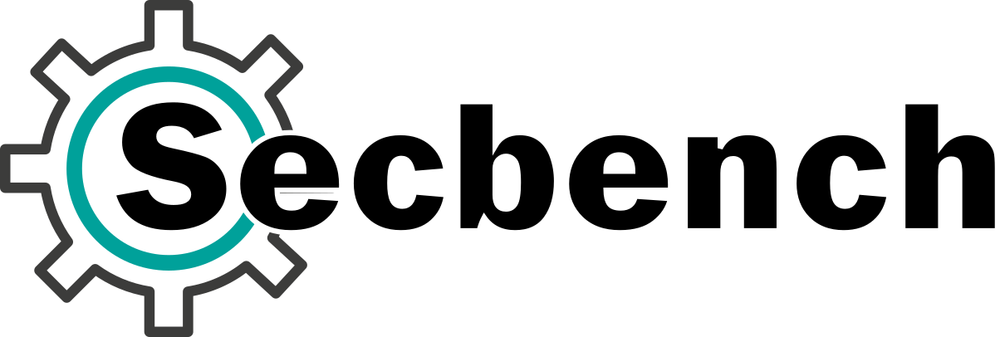
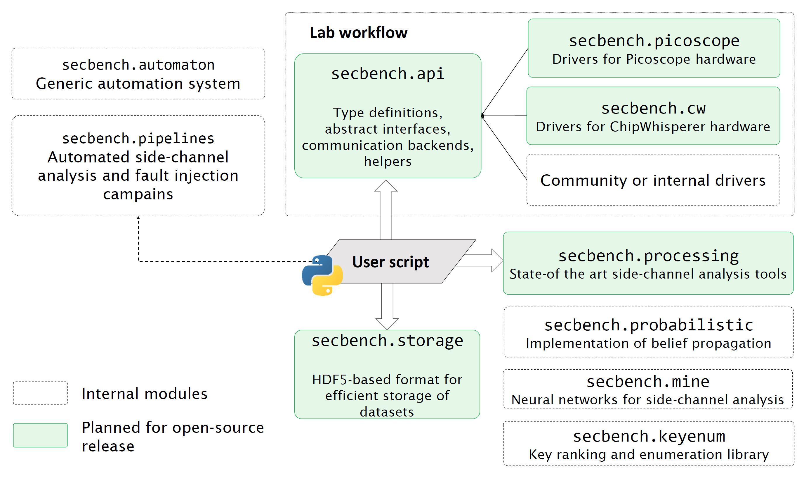

Secbench Framework
==================

Welcome to *Secbench* documentation! The *Secbench* project is a framework for
hardware security testing of systems. The framework has been developed since
2017 at `CEA-LETI <https://www.cea.fr/english>`__.

*Secbench* provides Python packages for side-channel analysis and fault
injection, that security researchers, teachers or students can use to create
complex and **reproducible experiments**. Here is an example side-channel
acquisition:

.. code-block:: python

    from secbench.api import get_bench

    bench = get_bench()
    scope = bench.get_scope()
    table = bench.get_table()

    table.move_to(x=0.5, y=1.2)
    scope.arm()
    # Let the target device compute.
    scope.wait()
    d, = scope.get_data("1")

A fault injection experiment can be written as:

.. code-block:: python

    from secbench.api import get_bench
    from secbench.api.instruments import EMPulser

    bench = get_bench()
    table = bench.get_table()
    pulser = bench.get(EMPulser)

    table.move_to(x=0.1, y=0.3)
    # Configure first channel of EM injector
    pulser["1"].setup(amplitude=500, width_ns=20, rise_time_ns=6)
    pulser.set_output_enabled(True)

    # Iterate delays
    for delay_ns in range(0, 200, 10):
        pulser.set_params(delay_ns=10)
        # 1. Let the target device compute and generate a trigger.
        # 2. Analyze response

As you probably noticed, *Secbench* allows describing experiments without
reference to the actual lab instruments, and the scripts can operate with
different vendors as long as drivers are implemented for
:py:mod:`secbench.api`.

The main components of the open-source version of Secbench are:

- :py:mod:`secbench.api`: a Python package that defines abstractions for common
  hardware used in security characterization (oscilloscopes, XYZ-Tables,
  injectors). Experiments are written using interfaces defined in
  :py:mod:`secbench.api` and concrete driver implementations are provided in
  separated packages (e.g., :py:mod:`secbench.picoscope`).
- :py:mod:`secbench.storage`: a thin wrapper on top of the HDF5 file format
  that allows creating and accessing side-channel datasets.
- :py:mod:`secbench.processing`: a collection of common side-channel processing
  tools.

Getting Started
---------------

Ready to start using secbench?

First :ref:`install secbench <sec:installation>`, then follow one of the :ref:`tutorials <sec:tutorials>`.
At any moment, you may also find the :ref:`API reference <sec:api_reference>` useful.

If you have any question or encounter some bugs, feel free to open a issue on the `main repository <https://github.com/CEA-Leti/secbench>`__.
You can also `contact us <mailto:support@secbench.fr>`__ for specific requests.

Table of Contents
-----------------

.. toctree::
   :maxdepth: 2

   installation.md
   tutorials/index.rst
   api-reference/index.rst
   glossary

About Secbench
--------------

Secbench is used internally at CEA to conduct security caracterisations.
Only the core parts of the framework are currently open-source.
The whole architecture is depicted on the following image.

   Overall architecture of the Secbench framework.

If you are interested in some other modules of the framework, please `contact us <mailto:support@secbench.fr>`__.

Contributors
------------

The following people contributed to Secbench:

- Thomas Hiscock (Maintainer)
- Julien Maillard
- Maxime Lecomte
- Lucas Malandrino-Guyot
- Antoine Moran
- Marine Sauze-Kadar
- Raphael Collado
- Thomas Loubier
- Alexandre Macabies

License
-------

This project is licensed under `CECILL-2.1 <http://www.cecill.info/index.en.html>`__  (see `LICENSE <https://github.com/CEA-Leti/secbench/blob/main/LICENSE>`__).

Indices and tables
------------------

* :ref:`genindex`
* :ref:`modindex`
* :ref:`search`
